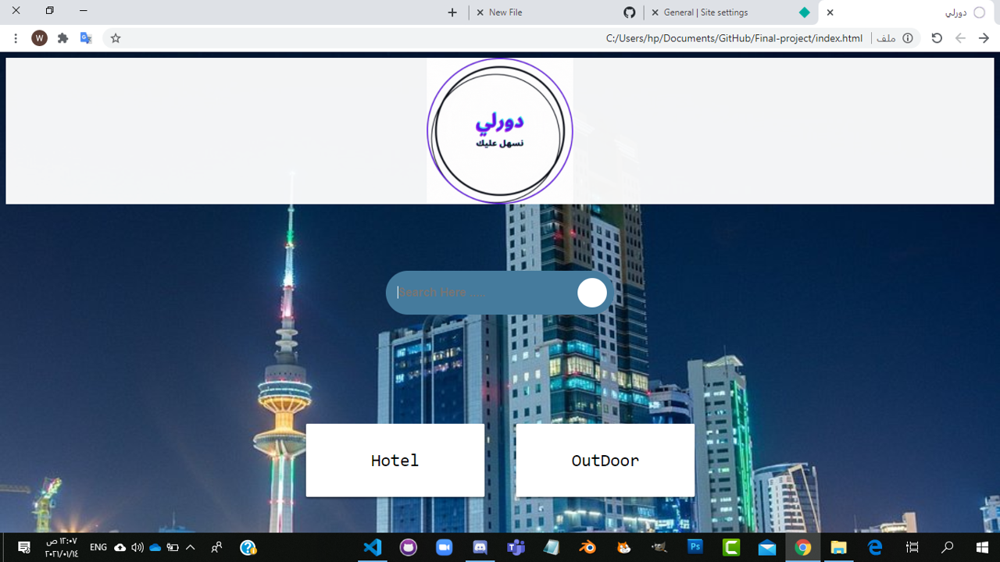
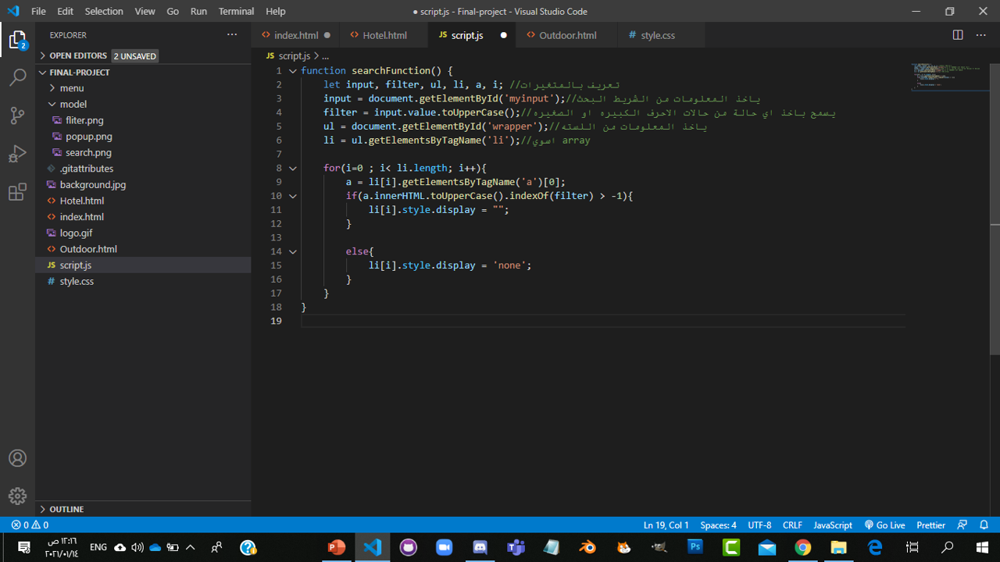
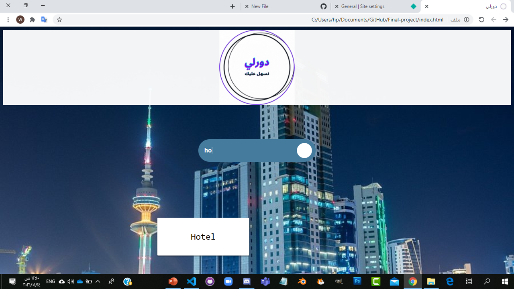
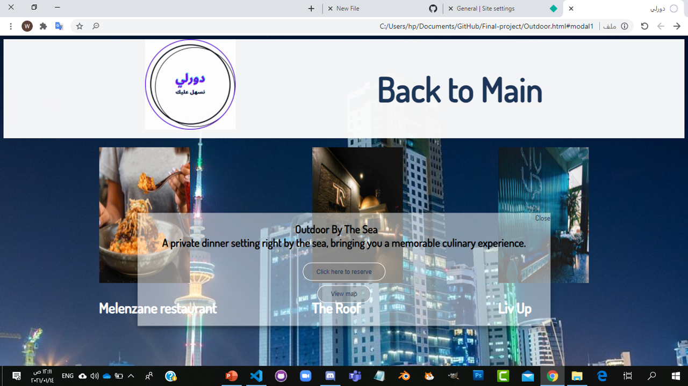

# Final-project1
final project

مشروعي النهائي سويته لان ابي اساعد الناس اللي مثلي ما يدرون وين يروحون للعشاء   
فعشان جذي سويت "دورلي" و خليت شعاري نسهل عليك  
القصد من دورلي هو للبحث عن المطاعم فالكويت 🍕🍔🍟🍿🌭🍗🥩  

 
حطيت في الوسط خيار البحث عن نوع الاكل او نوع اللوكيشن او اي شي بالمستقبل   

 
كود الجافا سكربت الخاص باخذ الكلام من شريط البحث للخيارات الموجوده عندي   

 
نلاحظ هني ان شريط البحث سوا مثل التصفيه للخيارات و طلع لي اللي انا كتبته 

 
حبيت اضيف المعلومات الخاصه بالمطاعم تكون PopUp باستخدام HTML&css   عشان ما تاخذ مساحة من الصفحة  

And that's it , I Hope you like it 😁😃😋😎✈  
https://dwrle.netlify.app/ <--- website link
